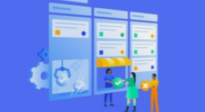

# Jira-Scrum_Projects_Concepts
Concepts of Scrum projects management with Jira agile

It is based in a [Udemy](https://www.udemy.com/) course.

**Status: Completed**

 
[Gestiona tu Proyecto Scrum con Jira Agile](https://www.udemy.com/course/scrum-jira/) by Hector Bravo

### Personal Set Up
- CUP: i5-7600K@3.80GHz 
- RAM: 16GB
- Environment: Windows 10
- Browser: Google Chrome (80)
- IDE: Visual Studio Code (1.71)
- IDE Extensions: Markdown all in one

  

# 1. Introducción
## 1.1. Jira
Jira fue desarrollado por la empresa australiana [Atlassian](https://www.atlassian.com/es).
Inicialmente se utilizó para el desarrollo de software, sirviendo de apoyo para la gestión de requisitos, seguimiento del estado de desarrollo y más tarde para la gestión de errores. Jira puede ser utilizado para la gestión y mejora de los procesos, gracias a sus funciones para la organización de flujos de trabajo
Es la herramienta numero uno para la gestión de proyectos: planificación, seguimeinto y reportes

## 1.2. Casos de uso para Jira
  - Los Product Owner (PO): Pueden crear el backlog del producto, programar sprint, lineas de tiempo
  - Los Porject Manager (PM) y Scrum Master (SM): Pueden gestionar el proyecto, el alacance, el backlog, los impedimentos, recursos
  - Los developers: Llevar el control de las actividades, seguimiento de bugs

## 1.3. Utilidades de Jira
  - Planificación ágil
  - Monitoreo y seguimiento
  - Deployments (liberaciones / releases)
  - Reportes
  - Integración

## 1.4. Jerarquia de Jira dentro de Atlassian:
  - Sitio/Empresa ([Atlassian](https://www.atlassian.com/es))
  - Productos (Jira)
  - Proyectos
  - Incidencias
	
## 1.5. Tipos de issues (incidencias)
  - Epic: Se puede descomponer en una o más user stories
  - User story: Se puede descomponer en una o multiples tareas
  - Bug
  - Task
  - Sub-Task
	
## 1.6. Productos Atalssian integrables con Jira
## 1.6.1. Confluence
Es una herramienta eficaz para crear, compartir, organizar y discutir el trabajo con tu equipo. Permite crear documentos en línea de manera colaborativa (algunas plantillas que provee: linea de tiempo, programar un proyecto, diseño de producto, minutas de reuniones).
[Confluence](https://www.atlassian.com/es/software/confluence) tiene los siguientes casos de uso:
  - Crear y compartir contenido
  - Versionado
  - Persona a persona
  - Inegración con Jira
  - Extendible con addons
  - Creado para equipos

### 1.6.2. Bamboo
Es un sistema de integración continua y automatización (como [Jenkins](https://www.jenkins.io/) o [Team City](https://www.jetbrains.com/teamcity/))
	
### 1.6.3. Bitbucket
Repositorio de código basado en [Git](https://git-scm.com/) (como [GitHub](https://github.com/))

### 1.6.4. Probar productos Atlassian
Los productos de [Atlassian](https://www.atlassian.com/es) tienen periodos de prueba que puede ser extendidos solicitándolo a sales@atlassian.com.

  

# 2. Conceptos de Scrum
Scrum es un marco de trabajo (framework) para la gestión agil de proyectos. Se puede utilizar en cualquier tipo de proyecto, pero sobre todo en los software. El concepto es dividir proyectos grandes en etapas más pequeñas, revisar y adaptar a lo largo del camino

## 2.1. ¿Por qué utilizar Scrum?
- Adraptable
  - Proyectos adaptables
  - Incorporación al cambio
- Transparencia
  - Información compartida
  - Ambiente de trabajo abierto 	
- Retroalimentación continua
  - Daily standup
  - Revisar y demo de sprints
- Mejora continua
  - Refinar backlog
  - Retrospectiva
- Entrega continua de valor
  - Proceso iterativo
  - Entregables de forma progresiva
- Ritmo sostenible
  - Duración definida de un sprint
  - Diseñado para ritmo sostenible
- Entrega anticipada de alto valor
  - Backlog priorizado
  - Entrega de requisitos de mayor valor
- Proceso de desarollo eficiente
  - Time-boxing (tiempo fijo definido)
  - Reducción de desperdicio
- Motivación
  - Daily standup
  - Retrospectiva
- Resolución de problemas más rápidos
  - Colaboración
  - Resolver impedimentos (scrum master)
- Entregables efectivos
  - Backlog priorizado
  - Revisiones periódicas de entregables
- Centrado en el cliente
  - Enfasis en el valor de negocio
  - Entorno de colaboración con stakeholders
- Ambiente de alta confianza
  - Transparencia y colaboración
  - Baja fricción entre colaboradores
- Responsabilidad colectiva
  - Comprometer historias de usuario
  - Hacer suyo el proyecto
- Alta velocidad
  - Entregas progresivas y priorizadas
  - Cliente percibe velocidad en los entregables
- Ambiente innovador
  - Retrospectiva de sprint y proyecto
  - Aprendizaje, adaptación que conlleva a un ambiente de trabajo innovador y creativo

## 2.2. Artefactos:
- **Backlog del producto**: Conjunto de todas las epics y user stories que se han definido
- **Backlog del sprint**: Es un subconjunto del backlog del producto que se van a desarrollar en cada sprint. Al inicio de cada sprint se seleccionan las user stories en las que se va a trabajar, se crea el backlog del sprint y luego se ejecuta el sprint.
- **Incremento**: Despues de cada sprint hay un incremento del producto potencialmente entregable, debido a la entrega gradual y progresiva del producto
- **Definición de terminado**: Hay que clarificar cuándo y cómo una user story está terminada. Es decir, desarrollada, testeada en UAT, y **con el OK del PO**.

## 2.3. Divison temporal y conceptos clave en proyectos
- **Sprint**: Iteración o periodo de trabajo donde se debe finalizar las user stories (En una metodología de cascada: analisis, diseño, desarrollo, testing e implementación). Suele durar de 2 a 4 semanas. Entrega progresiva y gradual de valor al cliente. En cada sprint se hará planificación / análisis, desarrollo, test, revisión y entrega.
- **Epic** (epopeya): Funionalidad o user story grande que debe ser dividida en user storiess
- **User story**: Funcionalidad / requisito que puede ser completado en un tiempo definido. Formato para redactar epics o user stories:
  - Como (rol de usuario) : Como usuario Web.
  - Quiero (objetivo): Quiero consultar las tablas de pedidos. 
  - Para poder (beneficio): Para conocer todos los pedidos
- **Task**: Pequeño incremento de trabajo. La user story está dividida en tareas
- **Medición de esfuerzo**: Con story points se indican los puntos de esfuerzo que miden la complejidad / esfuerzo que conlleva una user story / issue (código, tiempo, etc)
- **Roles**:
  - **Cliente**: Proporciona los requisitos al PO.
  - **Product Owner (PO)**: Dueño del producto. Persona principal de crear y mantener el backlog. Definir prioridades y criterios de aceptación. Intermediario con las otras areas de la empresa
  - **Scrum Master (SM)**: Líder, que verifica y valida que los principios y conceptos de Scrum se implementen de la manera correcta a lo largo del proyecto. Es como un coach. Resolver impedimentos
  - **Equipo Scrum:** Analista, diseñador, programadores, etc.

## 2.4. Eventos / Reuniones por Sprint
- Planificación de sprint: Planificar las historias de usuario y asignarlas
- Daily standup: Que hiciste ayer, qué haras hoy, posbiles impedimentos. Aquí el Scrum master debe ayyudar a resolver los problemas
- Revisión del sprint: Se hace una demo de las funcionalidades añadidas al producto en el sprint
- Retrospectiva del sprint: Que se hizo mal, que se hizo bien, que inconvenientes se encontraron
- Retrospectiva del proyecto: Que se hizo mal / bien a nivel de proyecto

## 2.5. Flujo de Scrum
- Guía SBOK: Define cuales son las mejores prácticas para implementar Scrum
- Fases genéricas de un proyecto:
  1. Inicio
  2. Planificación
  3. Ejecución / Monitoreo y control
  4. Cierre
- Ciclo de vida de un proyecto software:
  1. Evaluación y priorización
  2. Requerimientos detallados
  3. Diseño y análisis
  4. Codificación y pruebas del desarrollador
  5. QA / Pruebas de Aceptación
  6. Despliegue
- Fluoj de Scrum: Todo empieza con un caso de negocio del proyecto (business case).
  1. Caso de negocio del proyecto: Necesidad del cliente, oportunidad en el mercado
  2. Declaración de la visión del proyecto: Donde se describen los objetivos y metas del proyecto
  3. Backlog priorizado del producto / Cronograma de planificación del lanzamiento: Lista de requisitos
  4. Sprint backlog

## 2.6. Principios de Scrum
Son fundamentos básicos para implementar el framework. Pueden aplicarse a cualquier tipo de proyecto u organización y deben respetarse a fin de garantizar la aplicación adecuada de Scrum. Los aspectos y procesos de Scrum pueden modificarse para cumplir con los requisitos del proyecto o la organización que los usa. Los principios de Scrum se pueden listar de la siguente manera:
1. **Control del proceso empírico**. En Scrum, las decisiones se basan en la observación y la experimentación en vez de la planificación inicial detallada (hacemos planificación en cada Sprint). Se basa en las ideas principales de:
   - Transparencia: Proyecto visible a todo el mundo del equipo
   - Inspección: Revisar y obtener retroalimentación (uso de scrumboard)
   - Adaptación: Mejora continua. Mejoras en el trabajo
2. **Auto-organización**. Scrum cuenta con que los empleados tienen motivación propia y buscan aceptar mayores responsabilidades. Por tanto ofrecen más valor cuando se organizan por cuenta propia. El estilo de liderazgo preferido en Scrum, es el liderazgo servicial, el cual enfatiza los resultados, centrándose en las necesiades del equipo Scrum. En la vida real es complicado, por lo que hay que hacer inspección y empuje constante (PO y SM)
3. **Colaboración**. El equipo principal de Scrum trabaja e interactua con los stakeholders para crear y validar los resultados del proyecto. Se produce cuando se integra el aporte indiviual de cada miembro con fin de producir algo más grande. Se prefiere la co-ubicación
4. **Priorización basada en valor**. El framework Scrum se guia en ofrecer el máximo valor empresarial en un mínimo periodo de tiempo. La herramienta base para esto es la priorización, estas descisiones las debe tomar el PO.
5. **Time-boxing**(asignación de un bloque de tiempo). Scrum trata al tiempo como una de las limitantes más importantes en la gestión de proyectos. El fin de este principio es proponer la fijación de una cierta cantidad de tiempo para cada proceso y actividad en un proyecto Scrum.
6. **Desarrollo Iterativo**. Entregables progresivos. Permite modificaciones solicitadas por el cliente ya que es más flexible. El mismo cliente va tomando mayor conciencia de las funcionalidades de su producto y del alcance del mismo según se avanza y esto permite afinar mucho más en lo que se quiere y cómo se quiere.

## 2.7. Aspectos de Scrum
1. **Organización**
   - **Roles centrales**
     * <u>Prodcut Owner (PO)</u>: Es la voz del cliente. Crea y administra el backlog. Maximiza el valor. Define criterios de aceptación
     * <u>Scrum Master</u>: Facilitador que debe garantizar que el equipo pueda trabajar correctamente, resolviendo problemas e impedimentos y asegurar que se cumplan los los requisitos del framework de Scrum. Interactua con la organización, con el PO y con el equipo Scrum
     * <u>Equipo Scrum</u>: Los miembros deben tener diferentes habilidades. Deben entender los requisitos. Son los que crean los entregables del producto
   - **Roles no centrales**
     * <u>Stakeholders</u> (interesados en el proyecto)
     * <u>Scrum Guidance Body (SGB)</u>: Documentos / grupo de expertos
     * <u>Vendors (vendedores)</u>: Individuos u organizaciones externas que participan en el proyecto
   - **Organización real de un equipo Scrum**
     * <u>Project Manager</u>: Lidera el equipo. Responsable del proyecto. Debe preocuparse por alcanzar los objetivos
        - Desarrolla el plan de proyecto
    	- Gestiona las comunicaciones
    	- Gestiona el cronograma
    	- Gestiona el presupuesto
    	- Gestiona los interesados
    	- Gestiona el equipo de proyecto
    	- Gestiona conflictos
    	- Gestiona los riesgos
    	- Gestiona los entregables
    	- Interactua con: Organización, cliente, equipo de proyecto, otros departamentos, proveedores, gerentes funcionales.
     * <u>Scrum Master</u>
     * <u>Equipo Scrum</u>
     * <u>Product Owner</u>
     * <u>Cliente</u>
     * <u>Stakeholders</u>
   - Lo ideal es la coubicación por la facilidad de interacción y daily standup, aunque Scrum tb puede funcionar con equipos distribuidos
2. **Justificación del negocio**
   - Entrega impulsada por el valor
   - Incertidumbre sobre los resultados
   - Adaptabilidad de objetivos y procesos si se justifican ante negocio
3. **Calidad**
   - Capacidad de que los entregables cumplan los criterios de aceptación
   - Mejora continua
   - Asegurar criterio de aceptación continuo
4. **Cambio**
   - Aceptar cambios
   - Requisitos volátiles, que se van afinando conforme el proyecto avanza
   - Maximizar beneficios a partir de los cambios y minimizar impactos negativos
5. **Riesgo**
   - Riesgos positivos, son oportunidades
   - Riesgos negativos, son amenazas
   - La gestión de riesgos debe hacerse de manera preventiva y proactiva. Debe comenzar al inicio del proyecto y debe ser iterativo a lo largo del ciclo de vida del mismo
   - Plan de respuesta / mitigación de riesgos
		

## 2.8. Fases y procesos de Scrum
- Fases genéricas de un proyecto
  - Inicio
  - Planificación
  - Ejecución / Monitorización y control
  - Cierre
- Fases en Scrum (SBOK): 5 fases y 12 procesos
  - Inicio
    - Crear visión del proyecto
    - Identificar al Scrum master y stakeholders
    - Formar equipos
    - Desarrollar épicas
    - Crear Backlog priorizado del producto
    - Realizra la planificación de lanzamiento
  - Planificación y estimación
    - User stories (historias de usuario)
    - Estimar user stories
    - Comprometer user stories por Sprint
    - Identificar tasks
    - Estimar tasks
    - Crear el Sprint backlog
  - Implementación(**1**) / Revisión y retrospectiva(**2**). Son procesos paralelos
    - (**1**) Crear entregables
    - (**1**) Realizar daily
    - (**1**) Refinar el backlog priorizado del producto
    - (**2**) Demostrar y validar el sprint
    - (**2**) Retrospectiva del sprint			
- Lanzamiento
  - Enviar entregables
  - Retrospectiva del proyecto

  

# 3. Proyectos con Jira Software
## 3.1. Creación del proyecto
**TODO: add images** 
[Atlassian](https://www.atlassian.com/es) ofrece muchas plantillas para la creación del proyecto, pero depende del tipo de producto que tengas y proyecto que quieras hacer se ofrecen unas u otras plantillas. La plantilla Scrum es propia de Desarrollo Software y de lal producto Jira Software.
 
Una vez elegida la plantilla se puede leer la descripción y tras pulsar "usar plantilla" da a elegir el tipo de proyecto. Gestionado por Equipo (next-gen) o Gestionado por la Empresa. 
Si el equipo es pequeño (hasta 25 personas) y no hay mucha experiencia en Scrum / Jira, usar el primero, para proyectos más grandes o complejos y/o un equipo con conocimientos en Jira y Scrum elegir el segundo, que serí el clásico (tendría más opciones).
 
En el proceso se puede indicar que se va a conectar el proyecto Jira con otros productos de [Atlassian](https://www.atlassian.com/es) ([Bitbucket](https://bitbucket.org/) o [Confluence](https://www.atlassian.com/es/software/confluence)) o con otros externos como [GitHub](https://github.com/).

## 3.2. Gestión de usuarios, grupos y permisos
**TODO: add images** 
- Una vez creado el proyecto se requiere invitar a los componentes del equipo al mismo. Hay dos modos de hacerlo:
  - People (menu superior). Aquí se puede invitar a alguien o crear un grupo. Se da acceso por producto
  - Settings (menu superior). User management
- Desde el panel de Administración es posible revisar y crear grupos con sus permisos
- Para dar acceso a un producto: En Productos (menu superior) en Adminnistración, tenemos Manage Access
- Para crear un grupo, acceder al menu de grupos en Administration -> Directory -> Groups. Para añadir miembros en la creación del grupo, ya deben estar registrados en Jira. Cuando se le da a Show details del grupo, se pueden ver los miembros del grupo y los productos a los que puede acceder ese grupo
- El modelo de permisos:
  - Por nivel
    - A nivel de sitio (site), es el más alto
    - A nivel de aplicación
    - A nivel de proyecto
  - Tipo
    - Los permisos globales de Jira se aplican a todos los proyectos, son independientes de los permisos específicos del proyecto. Van por aplicación/producto y se pueden ver desde Administration
- Agregar personas a un proyecto gestionado por equipo: Dentro del proyecto, en Project Settings->Access. En la versión gratuita, la gente que invites al proyecto tendrá permiso de administrador y no se puede cambiar, en la versión de pago si.
- Agregar personas a un proyecto gestionado por la empresa: Dentro del proyecto, en Project Settings->Pelople. En versión gratuita, desde aquí no se puede hacer, pero sí desde la pantalla de Adminsitration
- Configuración de permisos en unproyecto gestionado por la empresa: Permite una configuración avanzada y por tanto organizar los permisos por esquema (conjuto de permisos que son asignados a un proyecto). En el proyecto, Project Settings-> Permissions

  
En resumen:
- La administración del sitio es utilizada para administrar usuarios y grupos, acceso al sitio, productos, seguridad.
- Los grupos permiten tener acceso al producto y a la administración
- Los permisos globales de Jira aplican a todos los proyectos y son otorgados por medio de grupos.
- Los permisos de un proyecto aplican al proyecto en particular.
- Cada proyecto gestionado por el equipo, tiene tres tipos de roles: Administrador, Member y Viewer
- Los proyectos gestionados por la empresa se manejan a través de esquemas de permisos, lo cual brinda mayor flexibilidad.

 

## 3.3. Opciones de configuración a destacar en un proyecto gestionado por equipo
**TODO: add images** 
- Se pueden redefinir los tipos de issues, añadiendo o eliminando campos a la misma (epicas, historias, tareas, subtareas, bugs)
- En la parte de notificaciones se puede configurar las notificaciones que se mandn por correo electrónico y a quien.
- En funciones (features) se pueden ver las funciones habilitadas a nivel de proyecto. En Apps puede agregar aplicaciones / addons (funcionalidades nativas que Jira no contempla)
- En el RoadMap es donde se planifican las épcias del proyecto y orden de liberación de las mismas
- En el backlog es donde se definen todas las issues del proyecto y se irán ejecutando en diferentes sprints
- El tablero, donde se organizan las issues de cada sprint según su estado (el cual es configurable)
- En informes se pueden sacar los reportes básicos de un proyecto next gen (gestionado por equipo)
- En issues se pueden buscar las issues del proyecto filtrándolas
- En la parte de Code es donde está la integración con Bitbucket
- Project Pages es donde se integra con Confluence

## 3.4 Opciones de configuración a destacar en un proyecto gestionado por empresa (clásico)
**TODO: add images** 
Un proyecto clásico posee todas las opciones de un proyecto next-gen, además de estas, se pueden destacar las siguentes:
- Automation, permite automatizar tareas dentro de la gestión del proyecto. Se pueden usar predefinidas y también definir propias
- En Summary es posible ver el resumen de todas las características del proyecto
- Se pueden hacer issues personalizadas, definir su visibilidad, campos que tienen, etc
- En Flujo de Trabajo, se pueden crear flujos de trabajos, que son los cambios de status y las reglas (de las issues). Se puede ver en sección de workflow
- En Informes, hay más variedad de informes
- Componetes es para agrupar funcionalidades en secciones
- Versiones para la gestión de veriones

  

# 4. El Backlog
## 4.1. Tipos de issues en Jira
Las issues definen el tipo de unidad de trabajo que se registra en el proyecto. Existen de varios tipos según el trabajo que representen y sirven para organizar, dimensionar y planificar el desarrollo del producto. Se podría resumir en qué se usan para:
- Registrar diferentes tipo de unidades de trabajo
- Cada tipo puede tener diferentes campos, pantallas y workflow
- Generar reportes sobre cada tipo específico

### 4.1.1. Epic
Funcionalidad grande que debe ser descompuesta en user stories (mayormente no se finaliza en un sprint)
- Funcionalidad grande que se puede descomponer
- Puede abarcar varios sprints, equipos, proyectos y tableros
- Se puede utilizar como contener de multiples historias de usuario
- Puede contener otros tipos de incidencias
- Ayudan a orgnizar el trabajo y simplificar el Backlog

### 4.1.2. User Story
Funcionalidad que puede ser dimensionada para acabar en un sprint (Caso de uso, CU)
- Requisito desde el punto de vista del usuario (CU) -> "Como" (rol de usuario), "Quiero" (objetivo), "Para poder" (beneficio)
- Pueden estar asociadas o no a una épica
- Pueden contener sub-tareas (tareas)

### 4.1.3. Bug
Es un error que debe ser corregido
- Un defecto que requiere ser corregido
- Durante los ciclos de testing se usan este tipo de issues para registrar los errores y tratarlos
- Debe ser asignado a un miembro del equipo para ser corregido y posteriormente verficado por QA
		
### 4.1.4. Task
Unidad simple de trabajo
- No tiene porque estar relacionada con una funcionalidad co requisito de usuario
- Se pueden utilizar para registrar requisitos no funcionales

### 4.1.5. Subtarea: Es parte de una issue. Cualquier issue se puede dividir en subtareas
- Debe tener una issue padre
- Permite que una issue pueda ser descompuesta en unidades de trabajo más pequeña
- Pueden ser descritas en un lenguaje más técnico que la issue padre
  
### 4.1.6. Personalizadas
Para propositos específicos

## 4.2. Crear el backlog del producto	
- El Backlog inicial del prodcuto se crea el la fase de inicio del proyecto y contiene las hitorias de usuario y épicas que se han recogido como alcance inicial
- Se detalla y mejora durante la fase de Planificación y Estimación
- Se refina a lo largo del proyecto
- La administración del Backlog es responsabilidad del PO
- En Jira, el backlog es un conjunto de issues (de los tipos ya vistos)
- Se pueden crear issues que cuelguen de una épica y otras issues que no
- Depende si el proyecto es tipo next gen o clasico, las vistas varían y también como se muestran las cosas. Además de depender de la versión de Jira
- Se puede asignar issues a una epica u otra arrastrando la issue sobre el menú de epicas directamente en el Backlog

## 4.3. Registrar los criterios de aceptación
- Brindan claridad al equipo respecto a lo que se espera de la historia d eusuario (deben ser precisos)
- Eliminan la ambiguedad de los requisitos, ayudando a la alienación de las espectativas
- Responsibilidad del PO apoyado por QA, definir y comunicar los criterios de aceptación al equipo Scrum
- Brindan el contexto para que el PO y QA decidan si la historia de usuario se ha completado satisfactoriamente
- Jira no tiene ningún campo para registrar los criterios de aceptación, por lo que la opción es crear un campo personalizado dentro de Historias de usuario desede Issues Type en el Project Settings

### 4.3.1. Elementos a considerar en criterios de aceptación
  1. Interfaz gráfica (aspecto, posición)
  2. Validaciones: reglas de validación, mensajes de usuario
  3. Comportamient: Qué pasa al pulsar un botón
  4. Flujo: Hacia donde y como debe fluir la información
  5. Resultado esperado
  6. Seguridad (características de seguridad requeridas)
  7. Rendimiento: velocidad o performance requerido

## 4.4. Registrar estimaciones
- Las estmiaciones son importantes para dimensionar el timepo y esfuerzo / complejidad para desarrollar una issue
- En Jira se puede estimar con:
  - Story points: Como dicta Scrum (se suele usar la serie de fibonacci: 1,2,3,5,8,13...)
  - Tiempo: Lo permite Jira 
- Existe varias técnicas para estimar las issues, pero hay que elegir una comun para todo el equipo. Al final el esfuerzo de hacer una epica será la suma de puntos de usuario de todas sus issues
- En los proyectos clasicos además de la estimación por story points, se puede hacer por tiempo (en los next-gen no). También se puede usar un time tracking para el seguimiento de horas de la issue

## 4.5. Ejemplo
Nuestro cliente posee varios centros de fisioterapia y ve una oportunidad de negocio en asistir a sus pacientes en casa / negocio, en lugar de la clínica. Además, en la zona hay muchos centros deportivos que estarían dispuestos a tener este servicio también. Por otro lado también hay posibilidad de venta online de productos para deportistas y gente con problemas de movildad.
Los usuarios de la aplicación tendrán su perfil donde podrán guardar sus fisioterapeutas preferidos, productos, etc, además de un registro de compras y contrataciones hechas. 

De lo propuesto por el cliente podemos pensar (sin entrar en detalle) en varias funcionalidades grandes o **épicas** para la aplicación web:
1. Login de usuario tanto con user/password como con Google o Facebook
2. Sección de perfil, donde configurar datos personales y tener el registro de actividad
3. Sección de búsqueda de profesional, dónde poder encontrar un profesional que se ajuste a las necesidades del usuario
4. Sección de busqueda y compra de productos
5. EXTRA: Sección de clases online de Yoga / Pilates
6. EXTRA: Sección de consultoría online
7. etc

Una vez hecho el estudio de estas épicas, habría que entrar en detalle de las **user stories** que podrían componer cada una de ellas, Además de tomar los criterios de aceptación (AC) del cliente, los cuales, nos servirán para tener una batería de tests. Por ejemplo para la épica 3:
1. Permitir busqueda por filtrado de varios campos como: Nombre, apellido, especialidad, años de experiencia, horario disponible (AC: - No contratación a partir de las 22h)
2. Permitir busqueda por geolocalización (AC: - Selección desde propia ubicación; - Selección desde cualquier ubiación)
3. Permitir la contratación de varios profesionales simultaneamente (AC: - Aplicar descuento; - Horarios en común; -etc)
4. Permitir la contratación por largos periodos, no sólo de manera puntual (AC: - Aplicar descuento)
5. etc

Una vez diferenciadas las user stories se deben planificar los sprints según necesidad del cliente. Es lo que nos permite una metodología ágil, hacer el producto productivo lo antes posible. Por ejemplo, el cliente considera que lo que necesitaría principalmente sería la épica 3 para empezar a obtener beneficios. Se podría hacer la 3 y la contratación vía telefónica hasta que la épica 2 estuviese completada y por tanto se pudiera contratar a través de la aplicación.

Antes de abordar la codificación del producto habría que hacer un estudio de los sistemas y plafaformas necesarios. Servidores, bases de datos, etc. Además de la tecnología a usar para desarrollar según las características del producto y habilidades del equipo Scrum disponible. Para los trabajos de configuración e integración de sistemas están pensadas las issues tipo **task**, ya que su fin no es funcional.

En este punto empezaría el desarrollo por sprints. Para cada user story que se vaya abordando, el equipo técnico ha de hacer un análisis para diferenciar **subtasks** y así poder estructurar el trabajo en unidades más pequeñas, viendo sus relaciones y bloqueos, pudiendo asignarlas así a diferentes miembros del equipo para mejorar el rendimiento del mismo. Este análisis ha de ser documentado y basado en los criterios de aceptación del cliente. 
Al inicio de cada sprint es donde se deben puntuar las issues y planificar en consecuencia de la capacidad del equipo. Aunque si la entrega del producto es fija, se deberán modificar el equipo para adaptarlo a la capacidad de cada sprint. Aquí lo ideal, es ser conscientes de la capacidad de trabajo del equipo y llegar a un concenso entre entregas de valor y sprints necesarios.

  

# 5. Definición y ejecuciónd e sprints
## 5.1. Crear un sprint y el backlog del sprint
**TODO: add images** 
- Dentro de la sección de backlog es posible crear los sprint añadiendo detalles del mismo como duración, fechas, metas, etc
- Es importante que las estimaciones estén indicadas antes de iniciar el sprint
- En la parte superior derecha del sprint se pueden ver los story points del sprint, los que estan en progreso y los terminados en los proyectos next-gen. En los clasicos aparece la opción de planificar sprint
	
## 5.2. Iniciar y finalizar un sprint
**TODO: add images** 
- Una vez creado el backlog del sprint se puede iniciar , y entonces será visible en el board
- El tablero es configurable, podemos añadir estado de las issues
- Al termianr/completar el sprint (botón) aparece un dialogo informativo, si alguna issue queda sin terminar, este dialogo da la opción de devolverla al backlog del proyecto o moverla a otro sprint.
- Cuando se completa un sprint se puede visualizar su report en la sección Reports en "Sprint burndown chart"
- En proyectos clasicos existe la sección "Active Sprint" donde se puede ver el estado del sprint actual. En proyectos next-gen es la sección "Board"
	
## 5.3. Configurar un tablero de sprint
**TODO: add images** 
- Una vez iniciado el Sprint se puede ir al tablero y configurarlo, cambiando por ejemplo el nombre de las columnas, agregar columnas
- Una buena practica si se encuentra un error en fase de QA es crear un bug, asociarlo a la historia en la que se produjo el error y añadirlo al sprint. AL relacionarlo con el icono de link dentro de la issue podemos elegir, el tipo de relacion (bloqueda, bloque, relacionada, etc). También se debe linkear la epica a la que pertenezca, por lógica a la epica de la Historia donde se produjo el error
- En el Board también podemos filtrar por texto, epicas, tipo, miembros.
- En el Board también existe la opción de automatización  para programar compilaciones, deployments, etc. Con integración con Bitbucket se podría programar una compilación
- El Board tb tiene otras opciones como edición, agrupación, etc pero son menos relevantes que las mencionadas
- Entre proyectos next-gen y clasicos las forma en que se presenta el Board es practicamente igual, pero si que es más rapido tratar con el next-gen. Anque en clasicos cada fase también tiene un estado asociado que tienen relación co los flujos de trabajo
- Los flujos de trabajo indican la relación entre las diferentes fases/estados de un sprint

## 5.4. Asignar issue al equipo
**TODO: add images** 
- Desde la propia issue, se puede asignar, estimar y poner prioridad
- No es buena practica añadir una issue a un sprint ya iniciado

  

# 6. Crear el RoadMap del Proyecto
## 6.1. La planificación de lanzamiento o RoadMap
**TODO: add images** 
- Es el calendario de entrega del producto en sus diferentes versiones
- Permite la alineación del equipo Scrum con el PO y stakeholders
- Se puede hacer un lanzamiento después de la creación o liberación por etapas
- El plan de lanzamiento se puede ir modificando según las necesidades del negocio
- Las liberaciones (despliegues en PROD) no tiene por qué hacerse después de cada sprint, si no que se puede planificar cuando hacerlas, y depsués de cada sprint sólo mostrar lo hecho y subirlo a un entorno de UAT.
- Hay que pensar cuando se quiere hacer las liberaciones y con qué (tiempo, producto), la tercera variable serían los recursos. Esta triada siempre se maneja como 2 fijas y 1 variables:
  - Si se require en tal fecha con el prodcuto en el estado x, habrá que aumentar / disminuir lso recursos
  - Si se quiere en tal fecha pero y los recursos fijos, habrá que cuadrar el producto a entregar
  - Si se requiere el producto y recursos fijos, habrá que que cuadrar la fecha
- La manera en la que Jira muestra el RoadMap tanto en proyectos clásicos como en next-gen es similar.
- Es posible crear RoadMaps avanzados usando addons del marketplace de Jira (easy agile roadmap for jira)
- Jira soporta versiones de forma nativa, cada versión del producto contendra unas determinadas issues que se liberarán en una determinada release. Las versiones sirven para:
  - Organizar issues
  - Ayudan a programar las siguientes releases
  - Permiten definir fechas de metas
  - Pueden ser usados en querys o reportes
- Las versiones pueden tener tres estados:
  - Unreleased
  - Released
  - Archived
- ¿Como se agreaga una issue a una versión? Dentro de los campos de la issue uno es "Versiones corregidas" o "Fix Versions". La versión debe ser previamente creada en Jira antes de asignarla
- Los componentes son otra funcionalidad de Jira que permite agrupar las issues, son subpartes de un proyecto desde el punto de vista de funcionalidad (módulo). Para agregar una issu a un componente se hace igual que con las versiones, un campo de la misma issue llamado "Comoponente" o "Component"
  - Ayudana agrupar y organizar las issues por módulo
  - Cada componente puede tener un responsable asignado
  - Se admiten en un sólo nivel, es decir, no se puede crear un subcomponente de un componente
- Estos cambios (versiones y componentes) se pueden hacer de manera masiva seleccionando varias issues
	
## 6.2. Como crear el RoadMap
**TODO: add images** 
El panel de RoadMap permite visualizar por semanas, meses o trimestre y tiene un filtro para buscar. Permite mover las epicas y marca los sprints en el calendario
	
## 6.3. Como crear un RoadMap avanzando
**TODO: add images** 
Buscando addons en el marketplace de jira, el addon comentado antes: easy agile roadmap for jira. Para ello, en el menú superior "Apps">"Explore more apps"
	
## 6.4 Versiones
**TODO: add images** 
- "Versiones" o "Releases" es una feature tanto de proyectos clasicos como next-gen, aunque es posible que en este ultimo esté desactivada y sea neceserio activarla
- Las opciones de la version (release) nos permite: publicar, archivar, editar y eliminar
- En cada issue se puede añadir la versión a la que pertenece (como se ha comentado antes), ya estará visible
- Cuando se crea una versión aparece en el RoadMap como un "hito" de proyecto
- Una vez todas las issues asignadas a la versión (release) estén completadas, se podrá publicar pulsando el botón en la pantalla de la versión
- Una misma issue puede pertenecer a varias versiones

## 6.5. Componentes
**TODO: add images** 
- Esta feature sólo está disponible para proyectos clásicos
- Sirve para agurpar issues por funcionalidad (módulo)
- Desde la opción "Componets" se puede crear
- Los componentes se pueden editar por su no se tiene algún dato de la misma
- Accediendo al componente se puede ver las issues asociadas (al igual que con las versiones)
- En cada issue se puede añadir el componente al que pertenece (como se ha comentado antes), ya estará visible
- Una misma issue puede pertenecer a varios componentes

  

# 7. Reportes y filtros
## 7.1. Busquedas y filtros
**TODO: add images** 
- Existe una busqueda rápida general en la parte superior de Jira: Incidencias, tableros, proyectos, filtros y personas
- Existen filtros predeterminados dependiendo de la sección del Jira en la que se esté, por ejemplo en la sección de Issues en proyectos clásicos en el menú de la izquierda.
- Existen filtros básicos, por ejemplo en la secciónd e Issues en la parte superior
- Existen busqueda avanzada, por ejemplo en la secciónd e Issues en la parte superior a la derecha. Permite JQL, java query language, también seleccionar columnas
- El listado de issues se puede ver en formato lista, valga la redundancia, y en formato detallado
- También es posible exportar la busqueda / filtraje realizado en diferentes formatos
- En los tableros también existen filtros de busqueda
		
## 7.2. Aprender JQL
**TODO: add images** 
JQL es el lenguaje usado para hacer busquedas avanzadas. Se puede consultar información en:
- https://www.atlassian.com/es/software/jira/guides/expand-jira/jql#advanced-search
- https://www.youtube.com/watch?v=v0kqoCTzGNI
	
## 7.3. Revisión y retrospectiva del Sprint
Explicación de reportes en https://support.atlassian.com/jira-software-cloud/docs/generate-a-report/

### 7.3.1. Demostración y revisión
**TODO: add images** 
- Se demuestran los entregables del sprint al PO y stakeholders (interesados relevantes)
- El proposito de esta reunión es lograr la aprobación y aceptación del PO respecto al producto o servicio
- Los entregables que cumplen los criterios de aceptación son aceptados
- Issues incompletas o rechazadas
  - Si los entregables no cumplen los criterios de aceptación o las pruebas de QA, son rechazadas
  - Las issues que no pasan las purebas de QA se devuelven al responsable asignado para corregir los defects siempre y cuando haya tiempo antes del fin del sprint
  - Las issues que al final no vayan a entregarse se pueden mover a otro sprint o al backlog del prodcuto
  - Dentro de la sección "Reports" se pueden extraer reports predeterminados (los 3 primeros son los más interesantes, leer la descirpción)
- Patrones que se deben evitar:
  - El equipo termina el sprint de forma temprana, no están asumiendo suficiente trabajo
  - El equipo excede las fechas planificadas para el sprint, se está comprometiendo demasiado trabajo
  - La línea de trabajo completado en la gráfica de burndown produce caídas pronunciadas en lugar de graudales, se debe descomponer el trabajo en tareas más pequeñas.
  - El PO agrega o cambia el alcance en mitad de un sprint		
### 7.3.2. Retrospectiva del sprint
- El equipo scrum asiste completo, el PO no es obligatorio
- El SM organiza y modera la reunión
- Es un modelo importante del framework de "inpección y adaptación" de Scrum y es el ultimo paso de un sprint
- Esencial celebrar la reunión en un entorno abierto y relajado para fomentar la completa participación de todos los miembros
- Objetivos de la retrospectiva:
  1. Identificar mejores prácticas para seguir haciendo
  2. Cosas a mejorar
  3. Problemas y bloqueos encontrados
- Resultados de la retrospectiva:
  1. Mejoras accionables acordadas
  2. Elementos de acción asignados
  3. Elementos no funcionales propuestos para el backlog del producto
  4. Registro de retrospectiva del sprint (documentar). Se puede usar confluence que posee una plantilla
  5. Lecciones aprendidas del equipo Scrum
	
### 7.3.3. Reportes en proyectos next-gen (gestionados por el equipo)
**TODO: add images** 
- Burnup Report: Compara los story points con las fechas. La línea diagonal indica la progresión ideal de avance y se ha de intentar que la línea de trabajo sea lo más parecida a esta. Esto se consigue dimensionando correctamente las historias de usuario en tareas y asignandolas en consecuencia. Refleja el trabajo realizado.
  - Dimensinamiento adecuado de tareas
  - Ajuste de sotry points a cada tareas
  - Asignación consecuente		
- Burndown Report: Igual qu el anterior pero refleja el trabajo restante.
- Velocidad: Compara los story points planificados contra los realizados. Sirve para medir la capacidad/velocidad del equipo de manera aproximada, ya que el que se realicen más o menos story points a veces puede depender de bloqueos u otros agentes externos. Se puede sacar una media de la velocidad del equipo.
- Acumulative Diagram Flow: Permite ver el avance del proyecto, viendo la relación entre issues totales, en progreso, QA y hechas. En diferentes rangos de tiempos. Esta herramienta se usa mucho en Lin y en Kanban.
- Burndown chart: Gráfica similar a la anterior pero en lugar de ir sumando story point, va restando a los totales del sprint.
	
### 7.3.4. Reportes en proyectos clasicos (gestionados por la empresa)
**TODO: add images** 
Se pueden crear los mismos reportes que con los proyectos next-gen además de otros añadidos. Aquí hay muchos tipos de report y se separan por tipos:
- Reports Agile: Relacionados con la metodología. Aquí se puede destacar el "Sprint report" que es una versión extendida del "Burndown" pero además lista las issues abordadas y se puede crear la reptrospectiva a partir de él conectando con Confluence(aunque en la versión que yo he probado no veo esto)
- Reports de desarrollo: Se vincula el proyecto con el repositorio para realizarlo
- Reports de anlálisis de issues
- Reports de pronostico y gestión (Forecast and management)
- Otros